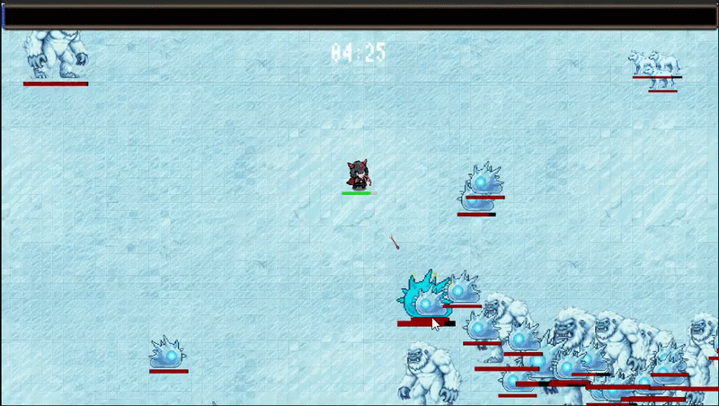
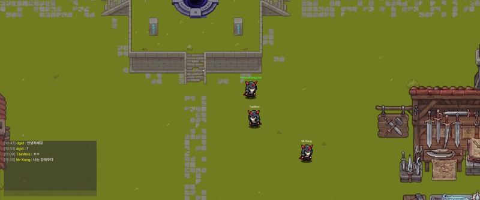
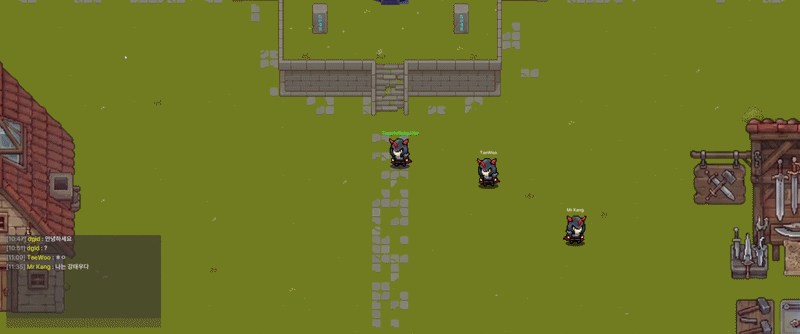

<h1>[캡스톤 디자인 프로젝트]</h1>

핵앤슬래시의 쾌감, 파밍과 성장의 재미를 얻을 수 있는 2D 탑다운 서바이벌 게임을 개발하는 soLIKE 팀입니다.

## 개요

- 프로젝트 이름 : Fifth Elemental
- 프로젝트 지속기간 : 2025.09 ~ 2026.03
- 개발 엔진 및 언어 : Unity & C#
- 멤버 : 허예준, 권율, 강태우, 박정태

## 게임 설명

몰려오는 적들을 쓸어버리는 핵앤슬래시의 쾌감과, 아이템을 파밍하고 성장하는 RPG의 재미를 결합한 2D 탑다운 서바이벌 게임

---

## 게임 플레이

### 보스 레이드

  

### 속성 인챈트 시스템

아이템 파밍을 통해 무기에 속성 인챈트를 적용, 다양한 전투 스타일 구현

  
  
  

  🔥 불 속성 &nbsp;&nbsp;&nbsp; ❄️ 얼음 속성 &nbsp;&nbsp;&nbsp; ⚡ 번개 속성

---

---

## 멀티플레이어

### 실시간 로비 동기화

Photon Fusion UDP 기반으로 로비에서 다른 플레이어의 움직임을 실시간 동기화

  
  

  ← 플레이어 1 시점 &nbsp;&nbsp;&nbsp;&nbsp; 플레이어 2 시점 →

---

## 기술 스택

| 구분       | 기술                         |
| ---------- | ---------------------------- |
| 클라이언트 | Unity 2022, C#               |
| 네트워크   | Photon Fusion (UDP)          |
| 백엔드     | ASP.NET Core 8, Redis, MySQL |
| 인프라     | AWS EC2, Docker              |

---

## 팀 soLIKE

| 이름   | 역할                      |
| ------ | ------------------------- |
| 권율   | 게임 클라이언트 (시스템 담당), 백엔드 서버 · 성능 최적화 |
| 강태우 | 게임 클라이언트 (전투 담당)|
| 박정태 | 게임 클라이언트 (던전 담당)|
| 허예준 | 게임 아트, 게임 클라이언트 |
